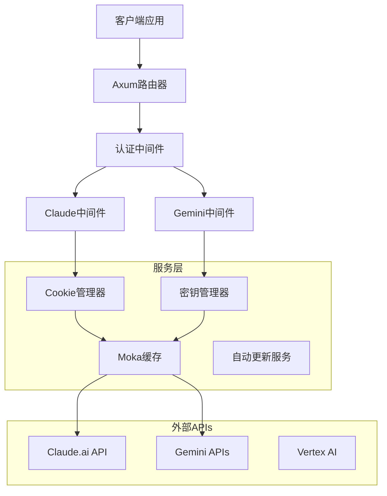

<div align="center">
  
  
  <p><em>现代化高性能 LLM 代理服务器</em></p>
  
  [](https://deepwiki.com/Xerxes-2/clewdr)
  [](https://github.com/Xerxes-2/clewdr/releases/latest)
  [](./LICENSE)
  [](#性能指标)
  [](#技术架构)

  <h3>🌍 语言支持</h3>
  <p>
    <a href="./README.md"><strong>🇺🇸 English</strong></a> |
    <a href="./README_zh.md"><strong>🇨🇳 简体中文</strong></a>
  </p>
</div>

---

## 🎯 **什么是 ClewdR？**

**ClewdR** 是一个生产级的高性能代理服务器，专为 **Claude**（Claude.ai、Claude Code）和 **Google Gemini**（AI Studio、Vertex AI）设计。使用 **Rust** 构建，追求极致性能和最小资源占用，提供企业级可靠性和消费级友好体验。

### 🏆 **为什么选择 ClewdR？**

- **🚄 10倍性能**: 超越脚本语言实现
- **💾 1/10内存**: 生产环境仅占用个位数MB
- **🔧 生产就绪**: 轻松处理每秒上千请求
- **🌐 多平台**: 原生支持 Windows、macOS、Linux、Android

## ✨ **核心功能**

<table>
  <tr>
    <td width="50%">

### 🎨 **全功能Web界面**

- **React驱动的控制台** 实时监控
- **多语言支持** 中英文界面
- **安全认证** 自动生成密码
- **热配置重载** 无需重启服务
- **可视化Cookie和Key管理**

### 🏗️ **企业级架构**

- **Tokio + Axum** 异步运行时最大吞吐量
- **事件驱动设计** 组件解耦
- **Moka缓存技术** 智能失效机制
- **Chrome级别指纹识别** 无缝API访问
- **多线程处理** 最优资源使用

### 🧠 **智能资源管理**

- **智能Cookie轮换** 状态分类
- **API密钥健康监控** 自动故障转移
- **限流保护** 指数退避算法
- **连接池优化** Keep-Alive保持

    </td>
    <td width="50%">

### 🌍 **通用兼容性**

- **静态编译** 单文件部署，零依赖
- **跨平台原生** Windows、macOS、Linux、Android
- **Docker就绪** 优化镜像
- **反向代理友好** 自定义端点支持

### 🚀 **协议支持**

#### **Claude集成**

- ✅ **Claude.ai** Web界面
- ✅ **Claude Code** 专门支持
- ✅ **系统提示缓存** 提升效率
- ✅ **扩展思考模式**
- ✅ **图片附件** 和网页搜索
- ✅ **自定义停止序列**

#### **Google Gemini集成**

- ✅ **AI Studio** 和 **Vertex AI**
- ✅ **OAuth2认证** 企业级
- ✅ **HTTP Keep-Alive** 优化
- ✅ **模型切换** 自动检测

#### **API兼容性**

- ✅ **OpenAI格式** 直接替换
- ✅ **原生格式** Claude和Gemini
- ✅ **流式响应** 实时处理

    </td>
  </tr>

</table>

## 📊 **性能指标**

<div align="center">

| 指标 | ClewdR | 传统代理 |
|------|--------|----------|
| **内存使用** | `<10 MB` | `100-500 MB` |
| **请求/秒** | `1000+` | `100-200` |
| **启动时间** | `<1 秒` | `5-15 秒` |
| **二进制大小** | `~15 MB` | `50-200 MB` |
| **依赖项** | `零依赖` | `Node.js/Python + 库` |

</div>

## 🚀 **快速上手指南**

### **第一步：下载运行**

```bash
# 下载对应平台的最新版本
wget https://github.com/Xerxes-2/clewdr/releases/latest/download/clewdr-[平台]

# 如果需要，解压二进制文件
tar -xzf clewdr-[平台].tar.gz

# 进入目录
cd clewdr-[平台]

# 赋予执行权限 (Linux/macOS)
chmod +x clewdr

# 运行 ClewdR
./clewdr
```

<details>
<summary>📦 <strong>平台下载链接</strong></summary>

| 平台 | 架构 | 下载链接 |
|------|------|----------|
| 🪟 Windows | x64 | [clewdr-windows-x64.exe](https://github.com/Xerxes-2/clewdr/releases/latest) |
| 🐧 Linux | x64 | [clewdr-linux-x64](https://github.com/Xerxes-2/clewdr/releases/latest) |
| 🐧 Linux | ARM64 | [clewdr-linux-arm64](https://github.com/Xerxes-2/clewdr/releases/latest) |
| 🍎 macOS | x64 | [clewdr-macos-x64](https://github.com/Xerxes-2/clewdr/releases/latest) |
| 🍎 macOS | ARM64 (M1/M2) | [clewdr-macos-arm64](https://github.com/Xerxes-2/clewdr/releases/latest) |
| 🤖 Android | ARM64 | [clewdr-android-arm64](https://github.com/Xerxes-2/clewdr/releases/latest) |

</details>

### **第二步：访问Web界面**

1. 🌐 在浏览器中打开 **`http://127.0.0.1:8484`**
2. 🔐 使用控制台显示的 **Web Admin Password** 登录
3. 🎉 欢迎来到 ClewdR 管理界面！

> **💡 专业提示:**
>
> - **忘记密码？** 删除 `clewdr.toml` 文件并重启
> - **Docker用户:** 密码显示在容器日志中
> - **修改密码:** 使用Web界面设置

### **第三步：配置服务**

<table>
<tr>
<td width="50%">

#### 🍃 **Claude 配置**

1. **添加Cookie**: 粘贴您的 Claude.ai 会话cookie
2. **配置代理**: 如需要设置上游代理
3. **测试连接**: 在控制台验证cookie状态

</td>
<td width="50%">

#### 🔹 **Gemini 配置**

1. **添加API密钥**: 输入您的 Google AI Studio 密钥
2. **Vertex AI** (可选): 为企业配置OAuth2
3. **模型选择**: 选择您偏好的模型

</td>
</tr>
</table>

### **第四步：连接应用程序**

ClewdR 提供多种API端点。查看控制台输出获取可用端点：

#### 🔗 **API端点**

```bash
# Claude 端点
Claude Web:    http://127.0.0.1:8484/v1/messages          # 原生格式
Claude OpenAI: http://127.0.0.1:8484/v1/chat/completions  # OpenAI兼容
Claude Code:   http://127.0.0.1:8484/code/v1/messages     # Claude Code

# Gemini 端点
Gemini Native: http://127.0.0.1:8484/v1/v1beta/generateContent    # 原生格式
Gemini OpenAI: http://127.0.0.1:8484/gemini/chat/completions      # OpenAI兼容
Vertex AI:     http://127.0.0.1:8484/v1/vertex/v1beta/            # Vertex AI
```

#### ⚙️ **应用配置示例**

<details>
<summary><strong>SillyTavern 配置</strong></summary>

```json
{
  "api_url": "http://127.0.0.1:8484/v1/chat/completions",
  "api_key": "控制台显示的API密码",
  "model": "claude-3-sonnet-20240229"
}
```

</details>

<details>
<summary><strong>Continue VSCode 扩展</strong></summary>

```json
{
  "models": [
    {
      "title": "Claude via ClewdR",
      "provider": "openai",
      "model": "claude-3-sonnet-20240229",
      "apiBase": "http://127.0.0.1:8484/v1/",
      "apiKey": "控制台显示的API密码"
    }
  ]
}
```

</details>

<details>
<summary><strong>Cursor IDE 配置</strong></summary>

```json
{
  "openaiApiBase": "http://127.0.0.1:8484/v1/",
  "openaiApiKey": "控制台显示的API密码"
}
```

</details>

### **第五步：验证监控**

- ✅ 在Web控制台检查cookie/密钥状态
- ✅ 监控请求日志确认连接成功
- ✅ 使用简单聊天请求测试
- ✅ 享受超快的LLM代理性能！

## 🔧 **高级配置**

<details>
<summary><strong>📝 配置文件 (clewdr.toml)</strong></summary>

```toml
# 网络配置
host = "127.0.0.1"
port = 8484
proxy = "http://your-proxy:8080"     # 上游代理 (可选)
rproxy = "https://custom-api.com"    # 反向代理端点 (可选)

# 性能调优
max_retries = 3                      # 最大重试次数
cache_response = 10                  # 缓存TTL分钟数
not_hash_system = false              # 在缓存键中包含系统提示
not_hash_last_n = 2                  # 从缓存键中排除最后N条消息

# Claude特定功能
preserve_chats = false               # 保留聊天历史
web_search = true                    # 启用网页搜索功能
use_real_roles = true                # 使用真实用户/助手角色
custom_system = "自定义提示"         # 覆盖系统提示

# 安全和限流
skip_rate_limit = true               # 绕过限流
skip_restricted = false              # 跳过受限账户
skip_non_pro = false                 # 跳过非专业账户

# 日志和监控
log_level = "info"                   # 日志级别: trace, debug, info, warn, error
log_file = "clewdr.log"             # 日志文件路径 (可选)
```

</details>

<details>
<summary><strong>🐳 Docker 部署</strong></summary>

```dockerfile
# 基本 Docker 运行
docker run -p 8484:8484 -v $(pwd)/config:/app/config xerxes2/clewdr:latest

# Docker Compose
version: '3.8'
services:
  clewdr:
    image: xerxes2/clewdr:latest
    ports:
      - "8484:8484"
    volumes:
      - ./config:/app/config
      - ./logs:/app/logs
    environment:
      - RUST_LOG=info
    restart: unless-stopped
```

</details>

<details>
<summary><strong>🔀 反向代理设置 (Nginx)</strong></summary>

```nginx
server {
    listen 443 ssl;
    server_name your-domain.com;
    
    ssl_certificate /path/to/cert.pem;
    ssl_certificate_key /path/to/key.pem;
    
    location / {
        proxy_pass http://127.0.0.1:8484;
        proxy_http_version 1.1;
        proxy_set_header Upgrade $http_upgrade;
        proxy_set_header Connection 'upgrade';
        proxy_set_header Host $host;
        proxy_set_header X-Real-IP $remote_addr;
        proxy_set_header X-Forwarded-For $proxy_add_x_forwarded_for;
        proxy_set_header X-Forwarded-Proto $scheme;
        proxy_cache_bypass $http_upgrade;
        proxy_read_timeout 300s;
        proxy_connect_timeout 75s;
    }
}
```

</details>

## 🏗️ **技术架构**

<div align="center">
  
  
  
  
</div>

### **🧩 组件架构**



### **⚡ 性能特性**

- **🔄 异步处理**: 基于Tokio构建最大并发
- **🧠 智能缓存**: Moka驱动的内容键缓存
- **🔧 连接池**: 重用连接优化性能
- **🎯 请求去重**: 自动处理重复请求
- **📊 内存效率**: 尽可能零拷贝操作
- **🚀 流式响应**: 实时响应流提升用户体验

## 🤝 **社区与支持**

<div align="center">

### 📚 **文档**

[](https://github.com/Xerxes-2/clewdr/wiki)
[](https://github.com/Xerxes-2/clewdr/issues)
[](https://github.com/Xerxes-2/clewdr/discussions)

### 🌟 **联系我们**

[](https://deepwiki.com/Xerxes-2/clewdr)
[](https://t.me/clewdr)

</div>

## 🙏 **致谢**

<table>
<tr>
<td align="center" width="50%">

### 🎯 **灵感来源**

**[Clewd 修改版](https://github.com/teralomaniac/clewd)**  
*原始Clewd的增强版本，为ClewdR的架构提供了许多创新想法和基础概念。*

</td>
<td align="center" width="50%">

### 🔧 **技术基础**

**[Clove](https://github.com/mirrorange/clove)**  
*提供了重要的Claude Code集成逻辑和认证机制，驱动ClewdR的Claude Code支持。*

</td>
</tr>
</table>

---

<div align="center">
  <h3>⭐ 如果ClewdR对您有帮助，请考虑给项目点个星！ ⭐</h3>
  
  <p><em>由ClewdR团队用❤️为AI社区构建</em></p>
  
  <sub>© 2024 ClewdR项目</sub>
</div>
